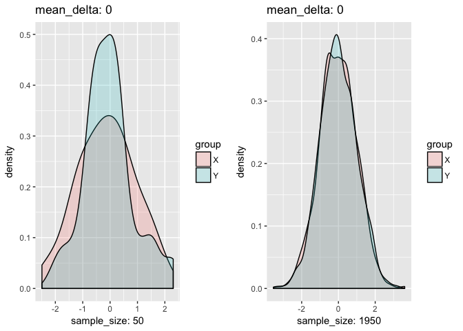
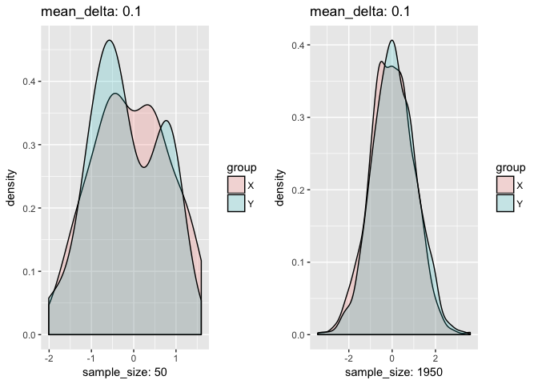
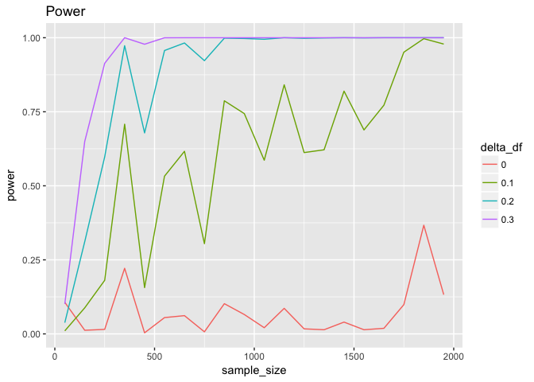
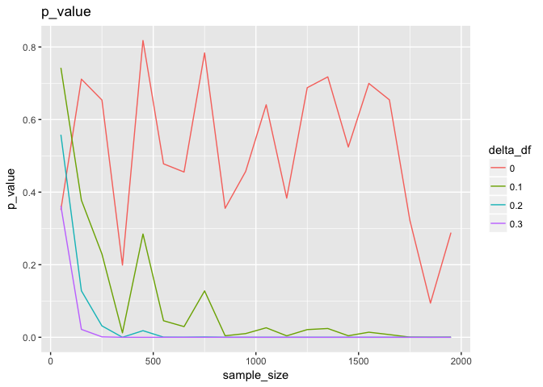
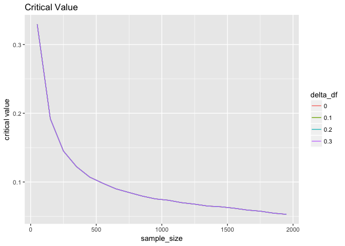

# Bootstrap for testing equality of means.
Zeinab Mousavi  


Bootstrap replications of a test statistic of interest for Hypothesis testing. 

###Description 
Inputs $X$ and $Y$ are two independent observed random samples drawn from two unknown populations with probability distributions of $F$ and $G$, respectively. 
For simplicity, we assume each population has a Gaussian distribution with variance 1. As a two-sample problem, we test the null hypothesis that the means of the two groups are equal, namely, 
Ho: $\delta = \mu_F - \mu_G = 0$

Consequently, the appropriate null distribution is one where the mean of the empirical distiburions $\hat{F}$ and $\hat{G}$ are equal. As such, we translate each observed data set by subtracting its mean and adding the mean of the combined sample. The translated datasets are denoted as $\tilde{X}$ and $\tilde{Y}$. Now that $\hat{F}$ and $\hat{G}$ have a common mean, through parametric bootstrapping of each translated dataset, we construct B bootstrap datasets, ($X^{*}$ and $Y^{*}$) on which we evaluate the test statistic, $\delta^{*^{b}}$ . In short, we constructed an estimate of the distribution of the test statistic under the null hypothesis, Ho. The fraction of times the test statistic of the bootstrapped samples is greater than the observed test statistic $\delta$, is the approximate p-value. 

The power calculation of the test is carried as usual. Bootstrap samples of the original data sets are consructed. The test statistic is evaluated for each bootstrapped set, providing an epproximation of the test statistic under the empirical distribution of the alternate hypothesis. The power of the test is the fraction of times the test statistic of the bootstrapped samples is greater than the critical value of the of the statistic, obtained from the empirical null distribution at alpha level 0.05. 

##Hypothesis Testing:
Null Hypothesis:      $\delta = \mu_F - \mu_G = 0$

Alternate Hypothesis: $\delta = \mu_F - \mu_G > 0$

###Inputs:
$x_i \in R$ for $i \in {1, ..., n_{1}}$ observed samples from $F$

$y_i \in R$ for $i \in {1, ..., n_{2}}$ observed samples from $G$

###Assumptions:
$F$ ~ $N(\mu_{1}, \sigma^{2})$

$G$ ~ $N(\mu_{2}, \sigma^{2})$

$\sigma^{2}$ = 1

###Outputs:
p-value for observed graph statistic, scalar

power of the test, scalar 

###Function:
Evaluate mean estimate of observed datasets

1. $\hat{\mu}_{x} = \frac{1}{n_1}{\sum_{i=1}^{n_1}x_i}$ 

2. $\hat{\mu}_{y} = \frac{1}{n_2}{\sum_{i=1}^{n_2}y_i}$ 

Compute observed test statistic 

3. $\hat\delta_{obs} = \hat{\mu}_{x} - \hat{\mu}_{y}$

Compute weighted (combined sample) mean

4. $\mu = \frac{n_{1}}{n}\mu_{x} + \frac{n_{1}}{n}\mu_{y}$, where $n = n_{1}+n_{2}$

Translate observed datasets in accordance with the Null Hypothesis

5a. $\tilde{x}_{i} = {x}_i - \mu_x + \mu$ 

5b. $\tilde{y}_{i} = {y}_i - \mu_y + \mu$

Construct Bootstrap Datasets

for b = {1, .., B}:

6a. $\tilde{x}^{b}_{i}$ ~ $N(\hat\mu_{\tilde{x}}, \sigma^{2})$ for $i \in {1, ..., n_{1}}$

6b. $\tilde{y}^{b}_{i}$ ~ $N(\hat\mu_{\tilde{y}}, \sigma^{2})$ for $i \in {1, ..., n_{2}}$

Compute the mean estimate of each bootstrapped dataset

7a. $\hat{\mu}^{b}_\tilde{x} = \frac{1}{n_1}{\sum_{i=1}^{n_2}\tilde{x}^{b}_i}$

7b. $\hat{\mu}^{b}_\tilde{y} = \frac{1}{n_2}{\sum_{i=1}^{n_2}\tilde{y}^{b}_i}$

Evaluate test statistic on dataset

8. $\hat\delta^{b} = \hat{\mu}^{b}_\tilde{x} - \hat{\mu}^{b}_\tilde{y}$ 

end 

Compute p-value

9. p-value : $\frac{count(\hat\delta^{b} \geq \hat\delta_{obs})}{B}$

Find critical value for $\alpha$ = 0.05

10. $\hat\delta_{c}$ = quantile $( \hat\delta^{b}, .95)$

###Power of Test

for b = {1, .., B}:

1a. $x^{b}_{i}$ ~ $N(\hat\mu_{x}, \sigma^{2})$ for $i \in {1, ..., n_{1}}$

1b. $y^{b}_{i}$ ~ N$(\hat\mu_{y}, \sigma^{2})$ for $i \in {1, ..., n_{2}}$

Compute the mean estimate of each bootstrapped dataset

2a. $\hat{\mu}^{b}_{x} = \frac{1}{n_1}{\sum_{i=1}^{n_2}x^{b}_i}$

2b. $\hat{\mu}^{b}_{y} = \frac{1}{n_2}{\sum_{i=1}^{n_2}y^{b}_i}$

Evaluate test statistic on dataset

3. $\hat\delta^{b} = \hat{\mu}^{b}_{x} - \hat{\mu}^{b}_{y}$ 

end 

Compute Power

4. Power = $\frac{count(\hat\delta^{b} \geq \hat\delta_{c})}{B}$

##Simulations 

Two datasets, with size n,  will be simulated by uninform sampling of 
two Gaussian distributions.

Success 

When the  difference between  the means of the two Gaussians is not 
zero, such as 0.1, we expect the Null Hypothesis to be rejected, p_value <0.05. We also expect the power of the test to inrease as sample size increases. 

Failure

When the  difference between the means of the two Gaussians is zero, we expect the Null Hypothesis to not be rejected. We also expect the power of the test to be small.

##Analysis
We will look at the p-value and power of the test in different scenarios.

##Write Code


```r
require(ggplot2)
source("multiplot.R")
```

####1. Generate simulated data for both settings with sample size of 100


```r
#success 
simulate <- function(n1, mean1, n2, delta, sigma){
  mean2 = mean1 + delta
  X <- rnorm (n=n1, mean=mean1, sd=sigma)
  Y <- rnorm (n=n2, mean=mean2, sd=sigma)

  observed_data <- data.frame(sample=numeric(0), group=numeric(0))
  sample_group = as.factor(rep("X", length(X)))
  temp_df <- data.frame(sample=X, group=sample_group)
  observed_data <- rbind(observed_data, temp_df)
  sample_group = as.factor(rep("Y", length(Y)))
  temp_df <- data.frame(sample=Y, group=sample_group)
  observed_data <- rbind(observed_data, temp_df)
  return(observed_data)
}
```


####2. Data Simulation & Algorithm Code 

```r
alpha = 0.05


d <- 0

test_dataframe <- data.frame(power_boot_df=numeric(0), p_value_df=numeric(0), ts_critical_null_df=numeric(0), delta_df=numeric(0))
n_sample <- seq(50, 2000, 100)
sigma=1
for (delta in seq(0, 0.3, 0.1)){ 
power_boot <- c()
p_value <-c()
ts_critical_null <- c()
k<-0 

for (n in n_sample){
  
  #Simulate observed samples
  data <- simulate(n1=n, mean1=0, n2=n, delta=delta, sigma=sigma)
  D1 <- data$sample[data$group=="X"]
  D2 <- data$sample[data$group=="Y"]

  #Plot observed data for smallest & largest sample size
  if (n==n_sample[1]){ 
  plot_title_1 <- paste("mean_delta: ", as.character(delta), sep="") 
  plot_title_2 <- paste("sample_size: ",as.character(n),sep="")
  p1 <- ggplot(data, aes(sample, fill = group)) +  geom_density(alpha =   0.2) +   xlim(min(data$sample), max(data$sample)) + labs(title=plot_title_1, x=plot_title_2)
  }
  if(n==tail(n_sample, 1)){
      plot_title_1 <- paste("mean_delta: ", as.character(delta), sep="") 
  plot_title_2 <- paste("sample_size: ",as.character(n),sep="")
  p2 <- ggplot(data, aes(sample, fill = group)) +  geom_density(alpha =   0.2) +   xlim(min(data$sample), max(data$sample)) + labs(title=plot_title_1, x=plot_title_2)
  multiplot(p1, p2, cols=2)
  }
  
  #estimate parameters of the two observed datasets
  D1_mean_est <- mean(D1)
  D2_mean_est <- mean(D2)
  D_weighted_mean <- (mean(D1)+mean(D2))/2
  #test statistic of the dataset 
  ts_data <- mean(D2) - mean(D1)
  
  ts_null <- c()
  ts_null_z <- c()

  #Translate observed datasets such that bootstrap samples will be drawn from the Null distribution 
  D1_mean_est_null <- mean(D1 - D1_mean_est + D_weighted_mean)
  D2_mean_est_null <- mean(D2 - D2_mean_est + D_weighted_mean)
  
  
  boot_strap <-5000
  for (b in seq(1, boot_strap, 1)){
    #generate from parameter estiamtes 
    set.seed(b)
    X <- rnorm(n=n, mean = D1_mean_est_null, sd=sigma) 
    Y <- rnorm(n=n, mean = D2_mean_est_null, sd=sigma)
    mean_estimate_X <- mean(X)
    mean_estimate_Y <- mean(Y)
    ts_null[b] <- mean_estimate_X - mean_estimate_Y
  }
  
  k<- k+1
  ts_critical_null[k] <- quantile(ts_null , 0.95)[[1]]
  p_value[k] <- sum(ts_null>ts_data)/boot_strap

  
ts_alt <- c()

#power

boot_strap <-5000
for (b in seq(1, boot_strap, 1)){
  set.seed(b)
  X <- rnorm(n=n, mean = D1_mean_est, sd=sigma) 
  Y <- rnorm(n=n, mean = D2_mean_est, sd=sigma) 
  mean_estimate_X <- mean(X)
  mean_estimate_Y <- mean(Y)
  ts_alt[b] <- mean_estimate_Y - mean_estimate_X
}


power_boot[k] <- sum(ts_alt>ts_critical_null[k])/boot_strap
}

test_dataframe_delta <- data.frame(power_boot_df=power_boot, p_value_df=p_value, ts_critical_null_df=ts_critical_null, delta_df=as.character(rep(delta, k)), n_sample_df=n_sample)

test_dataframe <- rbind(test_dataframe, test_dataframe_delta)

}
```

<!-- --><!-- --><!-- --><!-- -->
###Simulated Analysis

####Power as sample size increases
When the observed datasets are sampled from distributions with same means, I expect the power of the test to be low and not increase even with high sample size. 


```r
ggplot(data=test_dataframe, aes(x= n_sample_df, y=power_boot_df, colour=delta_df)) + geom_line() + labs(title="Power", x="sample_size", y="power")
```

<!-- -->
####P_value as sample size increases
When the observed datasets are sampled from distributions with different means, I expect the power of the test to increase as sample size increases. 

```r
ggplot(data=test_dataframe, aes(x= n_sample_df, y=p_value_df, colour=delta_df)) + geom_line() + labs(title="p_value", x="sample_size", y="p_value")
```

<!-- -->

####Critical_value as sample size increases
I expect the critical value, obtained from the 95% of the null distribution to decrease as sample size increases. However, I do not expect it to vary with the distribution of the original observed datasets (the difference in the empirical mean estimate of the observed datasets). This is because we adjust the observed datasets such that the empirical distribution of the test statistic is sampled under the null hypothesis. 


```r
ggplot(data=test_dataframe, aes(x= n_sample_df, y=ts_critical_null_df, colour=delta_df)) + geom_line() + labs(title="Critical Value", x="sample_size", y="critical value")
```

<!-- -->
