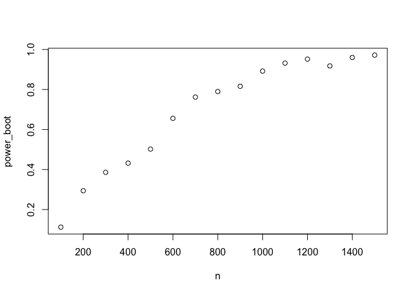

# Bootstrap Hypothesis Test GMM.
Zeinab Mousavi  


# Bootstrap Hypothesis Testing on GMM
H_null: Hellinger_distance2-Hellinger_distance1 = 0
H_alt:  Hellinger_distance2-Hellinger_distance1 > 0

Define Helllinger Distance 

```r
require(distrEx)

###HELLINGER DISTANCE####
Hellinger_Dist <- function(d1, d2){
  min_d1 = min(hist(d1, plot=FALSE)$breaks)
  max_d1 = max(hist(d1, plot=FALSE)$breaks)
  bin_width_d1 = mean(diff((hist(d1, plot=FALSE)$breaks)))
  min_d2 = min(hist(d2, plot=FALSE)$breaks)
  max_d2 = max(hist(d2, plot=FALSE)$breaks)
  bin_width_d2 = mean(diff((hist(d2, plot=FALSE)$breaks)))
  
  bin_width = min(bin_width_d1, bin_width_d2)
  min_break = min(min_d1, min_d2)
  max_break = max(max_d1, max_d2)
  h_breaks = seq(min_break, max_break, bin_width)
  h1 = hist(d1, breaks=h_breaks, plot=FALSE)
  h2 = hist(d2, breaks=h_breaks, plot=FALSE)
  p<- h1$density * diff(h1$breaks)
  q<- h2$density * diff(h2$breaks)
  Dist <- 1/sqrt(2)*sqrt(sum((sqrt(p)-sqrt(q))^2))
  return(Dist)
}
```


```r
GMM_sd <- c(1, 1)
GMM0_lambda <- c(0.3, 0.7)
GMM0_mean <- c(1, 8)
GMM1_lambda <-  c(0.3, 0.7)
GMM1_mean <-  c(1, 8)
GMM2_lambda <- c(0.4, 0.6)
GMM2_mean <- c(1.1, 8.1)


alpha = 0.05

k<-0 
power_boot <- c()
n <- seq(100, 1500, 100)

for (n_sample in n){
  #observed data
  set.seed(1)
  d0 = rnormmix(n=n_sample, lambda=GMM0_lambda, mu=GMM0_mean, sigma=GMM_sd)
  set.seed(1)
  d1 = rnormmix(n=n_sample, lambda=GMM1_lambda, mu=GMM1_mean, sigma=GMM_sd)
  set.seed(1)
  d2 = rnormmix(n=n_sample, lambda=GMM2_lambda, mu=GMM2_mean, sigma=GMM_sd)
  
  #Estimate Paramaters of Observed Samples 
  GMM0_EM = normalmixEM(d0, k=2, maxit=1000, sigma=c(1, 1)) 
  GMM0_lambda_estimate <- GMM0_EM$lambda
  GMM0_mean_estimate <- GMM0_EM$mu
  
  GMM1_EM = normalmixEM(d1, k=2, maxit=1000, sigma=c(1, 1)) 
  GMM1_lambda_estimate <- GMM1_EM$lambda
  GMM1_mean_estimate <- GMM1_EM$mu
  
  GMM2_EM = normalmixEM(d2, k=2, maxit=1000, sigma=c(1, 1)) #
  GMM2_lambda_estimate <- GMM2_EM$lambda
  GMM2_mean_estimate <- GMM2_EM$mu
  
  #Now generate Bootstrap Samples

  ts_null <- c()
  ts_alt <- c()
  boot_strap <-500
  for (b in seq(1, boot_strap, 1)){
    #generate from parameter estiamtes 
    set.seed(b)
    GMM0_boot <- rnormmix(n=n_sample, lambda=GMM0_lambda_estimate, mu=GMM0_mean_estimate, sigma=GMM_sd)
    GMM1_boot <- rnormmix(n=n_sample, lambda=GMM1_lambda_estimate, mu=GMM1_mean_estimate, sigma=GMM_sd)
    GMM2_boot <- rnormmix(n=n_sample, lambda=GMM2_lambda_estimate, mu=GMM2_mean_estimate, sigma=GMM_sd)
    
    ts_null[b] <- Hellinger_Dist(GMM1_boot, GMM0_boot)
    ts_alt[b]  <- Hellinger_Dist(GMM2_boot, GMM0_boot)
    
  }
  
  k <- k+1
  ts_critical_null <- quantile(ts_null , 0.95)[[1]]
  power_boot[k] <- sum(ts_alt>ts_critical_null)/boot_strap # =( 1- ecdf(ts_alt)(ts_critical_null))
  print (power_boot)

}
```

```
## number of iterations= 3 
## number of iterations= 3 
## number of iterations= 3 
## [1] 0.112
## number of iterations= 4 
## number of iterations= 5 
## number of iterations= 4 
## [1] 0.112 0.294
## number of iterations= 6 
## number of iterations= 3 
## number of iterations= 3 
## [1] 0.112 0.294 0.386
## number of iterations= 6 
## number of iterations= 5 
## number of iterations= 4 
## [1] 0.112 0.294 0.386 0.432
## number of iterations= 3 
## number of iterations= 4 
## number of iterations= 6 
## [1] 0.112 0.294 0.386 0.432 0.502
## number of iterations= 4 
## number of iterations= 4 
## number of iterations= 5 
## [1] 0.112 0.294 0.386 0.432 0.502 0.656
## number of iterations= 5 
## number of iterations= 9 
## number of iterations= 5 
## [1] 0.112 0.294 0.386 0.432 0.502 0.656 0.762
## number of iterations= 5 
## number of iterations= 4 
## number of iterations= 4 
## [1] 0.112 0.294 0.386 0.432 0.502 0.656 0.762 0.790
## number of iterations= 5 
## number of iterations= 6 
## number of iterations= 5 
## [1] 0.112 0.294 0.386 0.432 0.502 0.656 0.762 0.790 0.816
## number of iterations= 5 
## number of iterations= 5 
## number of iterations= 6 
##  [1] 0.112 0.294 0.386 0.432 0.502 0.656 0.762 0.790 0.816 0.892
## number of iterations= 5 
## number of iterations= 5 
## number of iterations= 5 
##  [1] 0.112 0.294 0.386 0.432 0.502 0.656 0.762 0.790 0.816 0.892 0.932
## number of iterations= 6 
## number of iterations= 8 
## number of iterations= 5 
##  [1] 0.112 0.294 0.386 0.432 0.502 0.656 0.762 0.790 0.816 0.892 0.932
## [12] 0.952
## number of iterations= 4 
## number of iterations= 5 
## number of iterations= 6 
##  [1] 0.112 0.294 0.386 0.432 0.502 0.656 0.762 0.790 0.816 0.892 0.932
## [12] 0.952 0.918
## number of iterations= 5 
## number of iterations= 7 
## number of iterations= 6 
##  [1] 0.112 0.294 0.386 0.432 0.502 0.656 0.762 0.790 0.816 0.892 0.932
## [12] 0.952 0.918 0.960
## number of iterations= 5 
## number of iterations= 4 
## number of iterations= 4 
##  [1] 0.112 0.294 0.386 0.432 0.502 0.656 0.762 0.790 0.816 0.892 0.932
## [12] 0.952 0.918 0.960 0.972
```

```r
plot(n, power_boot)
```

<!-- -->
