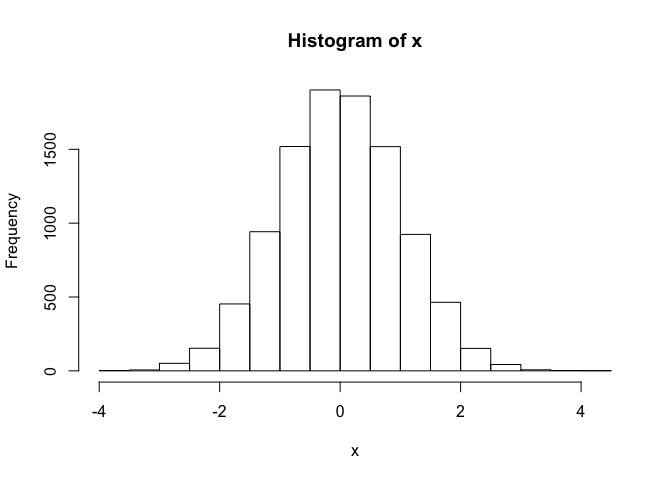
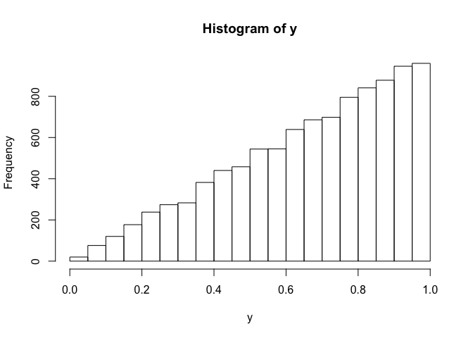

# Graph RMarkdown file.
Zeinab Mousavi  


## Data Preparation 

The data have been imported and set up in .... 


```r
Sys.time()
```

```
## [1] "2016-11-04 15:30:42 EDT"
```

```r
require("functions2.R")
```

```
## Loading required package: functions2.R
```

```
## Warning in library(package, lib.loc = lib.loc, character.only = TRUE,
## logical.return = TRUE, : there is no package called 'functions2.R'
```

# Normal distribution

Here is code to plot a normal distribution 
[link](www.google.com)


```r
x <- rnorm(1e4)
hist(x)
```

<!-- -->

## Beta distribution 

Here is soem code to plot a beta


```r
y <- rbeta(1e4, shape1 = 2, shape2 = 1)
hist(y)
```

<!-- -->


