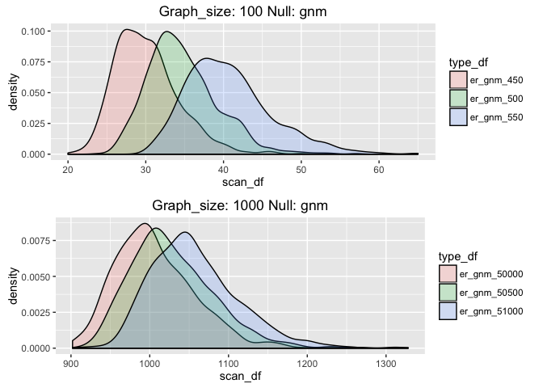

# Compare Variance of ER_gnp Distributions as Graph Size
Zeinab Mousavi  


## How does graph size affect the null distribution in the ER_gnm case?

```r
library(grid)
library(gridExtra)
source("multiplot.R")
source("functions2.R")
```

####Graph Parameters 

```r
p = 0.1
m_size_fraction = 1/20
q =0.5 
pm <- cbind( c(p, p), c(p, q) )
n_sample <- 1000
```

###Generate Null Distributions for Graphs Sampled from SBM with 1000 Vertices

```r
#for experiment let's sample a 1000v-SBM
graph_size <-1000
m_size <- floor(graph_size*m_size_fraction)
n_size <- (graph_size - m_size)
block_sizes = c(n_size,m_size)
sbm_size_dist <- c(rep(0, n_sample))

sbm_sizes = c(50000, 50500, 51000)
scan_null <- c(rep(0, n_sample))
i=0
null_er_gnm_df <- data.frame(scan_df=numeric(0), type_df=numeric(0))
for (sbm_size in sbm_sizes){
    i=i+1
    for (z in seq(1, n_sample, 1)){
        
        g_null <- erdos.renyi.game(graph_size, sbm_size, type = "gnm")
        scan_null[z] = max(local_scan(g_null))
    }
    type <- paste("er_gnm_", as.character(sbm_size), sep="")
    df_temp<- data.frame(scan_df=scan_null, type_df=as.factor((rep(type, length(scan_null)))))
    null_er_gnm_df <- rbind(null_er_gnm_df, df_temp)
    
  
}
graph_title_1000 = paste("Graph_size: ", as.character(graph_size), " Null: gnm", sep="")

plot_1000 <- ggplot(null_er_gnm_df, aes(scan_df, fill = type_df)) +
    geom_density(alpha = 0.2) + xlim(min(null_er_gnm_df$scan_df), max(null_er_gnm_df$scan_df)) + ggtitle(graph_title_1000) 
```

###Generate Null Distributions for Graphs Sampled from SBM with 100 Vertices

```r
graph_size <-100
m_size <- floor(graph_size*m_size_fraction)
n_size <- (graph_size - m_size)
block_sizes = c(n_size,m_size)
sbm_size_dist <- c(rep(0, n_sample))

sbm_sizes = c(450, 500, 550)
scan_null <- c(rep(0, n_sample))
i=0
null_er_gnm_df <- data.frame(scan_df=numeric(0), type_df=numeric(0))
for (sbm_size in sbm_sizes){
    i=i+1
    for (z in seq(1, n_sample, 1)){
        
        g_null <- erdos.renyi.game(graph_size, sbm_size, type = "gnm")
        scan_null[z] = max(local_scan(g_null))
    }
    type <- paste("er_gnm_", as.character(sbm_size), sep="")
    df_temp<- data.frame(scan_df=scan_null, type_df=as.factor((rep(type, length(scan_null)))))
    null_er_gnm_df <- rbind(null_er_gnm_df, df_temp)
    
}

graph_title_100 = paste("Graph_size: ", as.character(graph_size), " Null: gnm", sep="")

plot_100 <- ggplot(null_er_gnm_df, aes(scan_df, fill = type_df)) +
    geom_density(alpha = 0.2) + xlim(min(null_er_gnm_df$scan_df), max(null_er_gnm_df$scan_df)) + ggtitle(graph_title_100) 


multiplot(plot_100, plot_1000, cols=1)
```

<!-- -->


