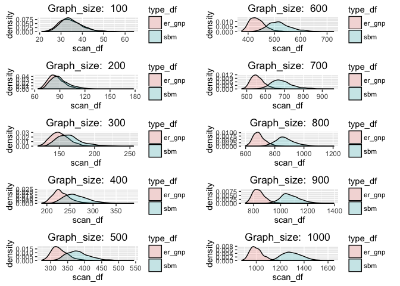
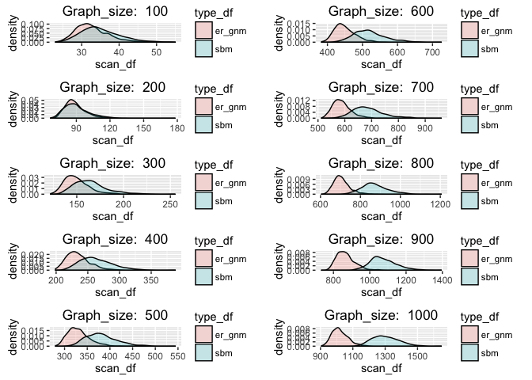

# Null vs Alternate Distributions
Zeinab Mousavi  


## Generate Null and Alternate Distributions for Varying Graph size

```r
library(grid)
library(gridExtra)
source("multiplot.R")
source("functions2.R")
```

###Null: ER_gnp Alternate: SBM

```r
graph_sizes = seq(100, 1000, 100)
null="er_gnp"
null_alt_dist(null, graph_sizes)
```

<!-- -->

###Null: ER_gnm Alternate: SBM

```r
graph_sizes = seq(100, 1000, 100)
null="er_gnm"
null_alt_dist(null, graph_sizes)
```

<!-- -->


